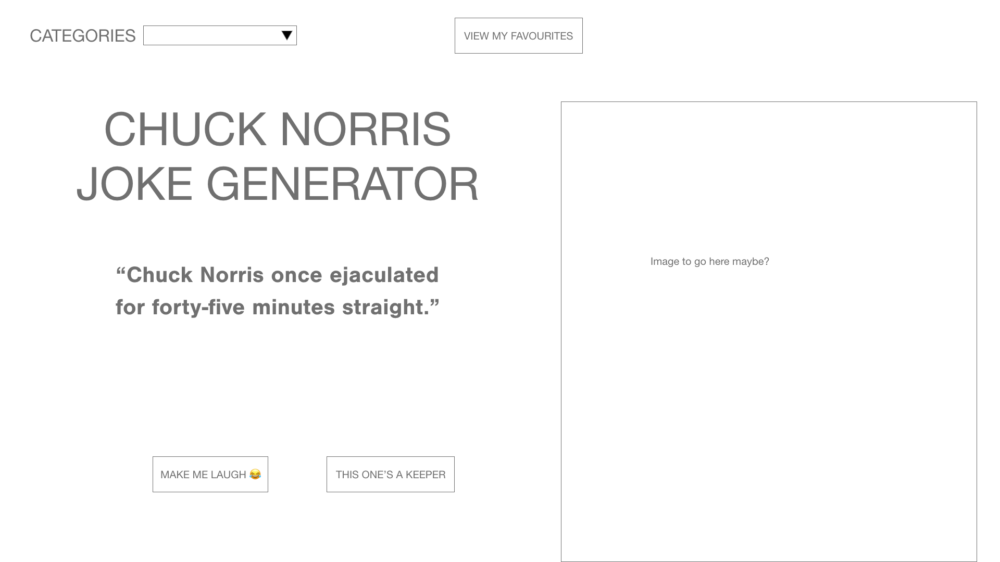
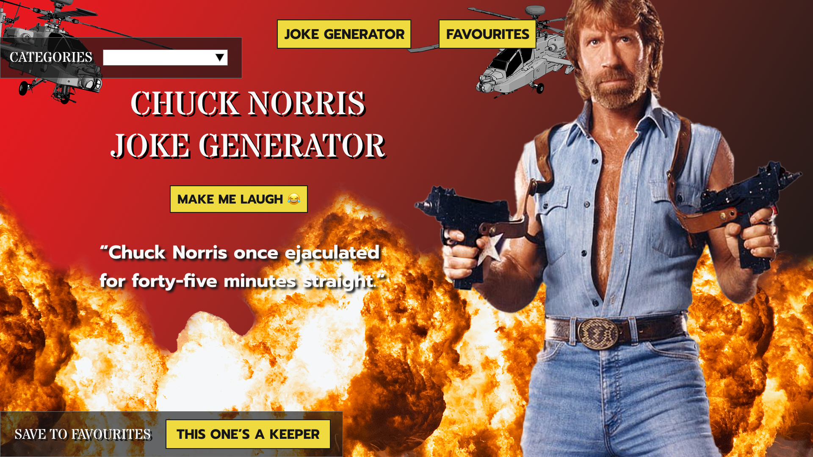
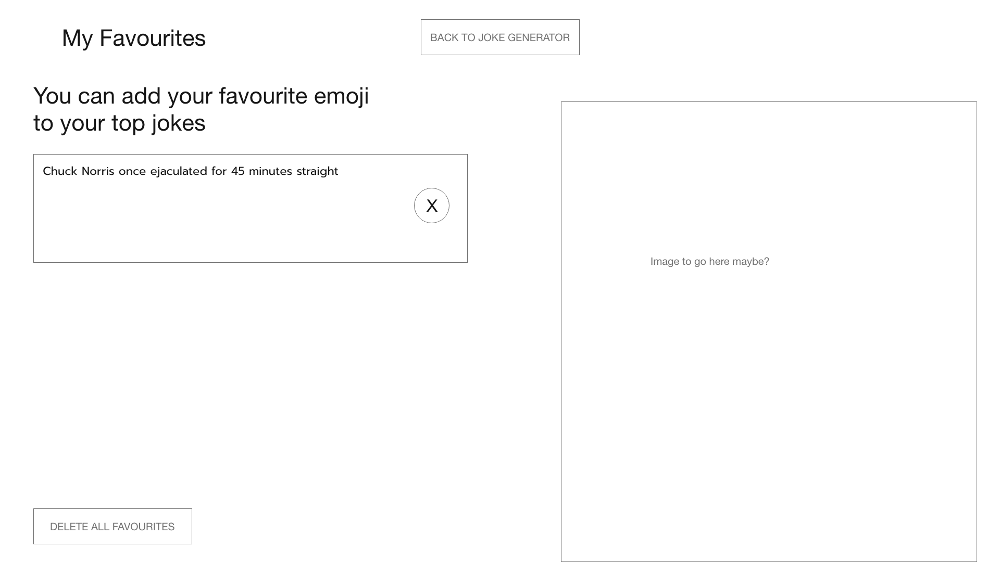
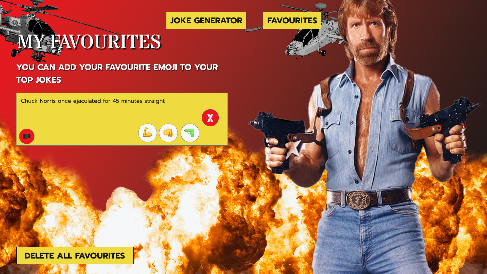
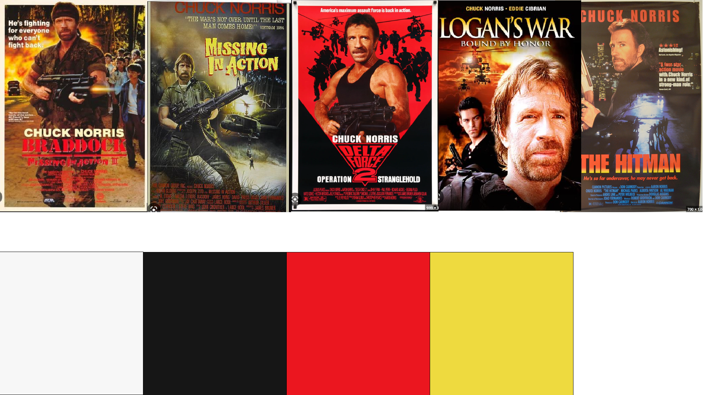

# Chuck Norris Joke Generator 

## About this Project
Hello! I'm Patrick and I created this Chuck Norris Joke Generator

I built this apoplication using react as part of the software immersive course I am studying iwth at general assemebly.

To begin with I created a set of User Stories to defien the parts of the application that I need to design and build to show my newly learnt skills with react and api's

I had a minimum viable product requirement for this project which included: 

- Add a new item to a list
- Mark the item as complete/favorite/(watch, read, listen) later/flag/etc
- Edit an item from a list
- Remove an item from a list
- Clear/delete all items
- Clear/delete only marked items
- Fetch data from at least one 3rd party API using Axios or fetch.
- Make frequent Git commits with descriptive messages, explaining your commit.
- Use React Router to handle multiple pages/views.

For this project after hunting around the internet for an api that I felt I wanted to use, I can across the chucknorris joke api at chucknorris.io. This api suit my project perfectly and had some additional addons including a category filter which I utilised in this project.

## Planning

### User Stories

Here are my user stories:

As a user I need to be able to get jokes from the app on a button click
As a user I want to be able to store my favourite jokes
As a user a want to be able to flag our highlight my favourites of these selected jokes
As a user I want to be able to delete sperate jokes from my favourites
As a user I want to be able to clear all my favourites with one button click
As a user I should be able to edit or add to the jokes in some way

### Wireframes

As part of my planning I designed a rough wireframe and then a more detailed wireframe for each of the pages that I am going to create for the application. Below you can see the evolution of my planning

### Colors and Fonts

I like to spend quite a bit of bit on exploring colours and fonts with my work as I feel that they are an extremely important part of the aesthetic feel of any page or application. 

#### Color
Here are my explorations into color

I decided to look at how his movies had been portrayed and noticed a particular them for using high contrast yellow & red. I then picked the particular hex's from these and modified them slightly to my chosen color and added a pair of neutrals (white and black).

#### Font

Here are my exploration into fonts:

