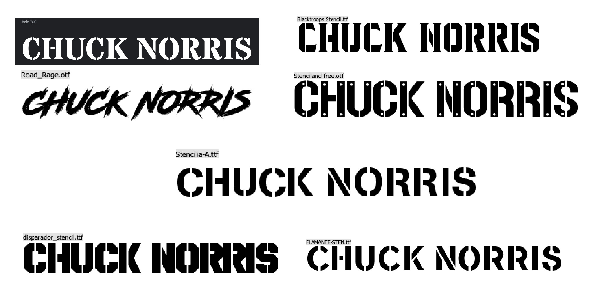

# Chuck Norris Joke Generator 

## About this Project
Hello! I'm Patrick and I created this Chuck Norris Joke Generator

I built this application using react as part of the software immersive course I am studying with general assemebly.

To begin with I created a set of User Stories to define the parts of the application that I need to design and build to show my newly learnt skills with react and api's

I had a minimum viable product requirement for this project which included: 

- Add a new item to a list
- Mark the item as complete/favorite/(watch, read, listen) later/flag/etc
- Edit an item from a list
- Remove an item from a list
- Clear/delete all items
- Clear/delete only marked items
- Fetch data from at least one 3rd party API using Axios or fetch.
- Make frequent Git commits with descriptive messages, explaining your commit.
- Use React Router to handle multiple pages/views.

For this project, after hunting around the internet for an api that I felt I wanted to use, I can across the chucknorris joke api at chucknorris.io. This api suited my project perfectly and had some additional addons including a category filter which I utilised in this project.

## Planning

### User Stories

Here are my user stories:

As a user I need to be able to get jokes from the app on a button click
As a user I want to be able to store my favourite jokes
As a user a want to be able to flag or highlight my favourites of these selected jokes
As a user I want to be able to delete seperate jokes from my favourites
As a user I want to be able to clear all my favourites with one button click
As a user I should be able to edit or add to the jokes in some way

### Wireframes

As part of my planning I designed a rough wireframe and then a more detailed wireframe for each of the pages that I am going to create for the application. Below is the basic wireframes for my app

### Colors and Fonts

I like to spend quite a bit of time on exploring colours and fonts with my work, as I feel that they are an extremely important part of the aesthetic feel of any page or application. 

#### Colours
Here are my explorations into color

I decided to look at how Chuck Norris movies had been portrayed and noticed a particular theme for using high contrast yellows & reds. I then picked the particular hex's from these and modified them slightly to my chosen colors and added a pair of neutrals (white and black).

#### Fonts

Here are my exploration into fonts:

I wanted a font that had a feel for old style action movies, kind of simialr to the A team font. I eventually found a classic style stencil font that felt like the right one called 'Stardos Stencil' (top left) which was the most legible whilst also have the styling that I wanted.

I took all the exploration from above and created a background using photoshop, I wanted to bring some fo the general chuck norris asetetics to the background and found a license free transparent png of him from one of his movies. I also added an explosion which I edited the sky out of, and overlayed it onto the gradient background. I also wanted something to fill the upper corners and balance the image, so I found some illustrator vectors of apache helicopters as this was similar to some eof the movie featured images I had found for the colour exploration.

Here is the finalised detailed wireframes I created:

## Features

Here is a list of the features that I created for my application

- Users can pull a random Chuck Norris Joke from the Api
- The joke is displayed on the main joke generator screen 
- A particular joke can be picked from a category of jokes and then the 'make me laugh' button pulls from this category
- Jokes can be saved to favourites and viewed on the favourites page
- favourited jokes can be flagged to highlight them
- favourited jokes can have select emojis added to them to emphisize them
- jokes can be deleted individually from the favourites or a user can delete all at once with a button.
- app has conditional styling to help with UI on flagging.

## Techonologies and Languages Used

- Javascript
- React 
- CSS
- Adobe Photoshop
- Adobe Illustrator

## How to use the App

When loaded the app should look like this:

You shuold then click on joke generator and ask for your first chuck norris joke, you can also select a category before hand if you like in the top left corner.

If you find a particular joke that you really like you can save it to your favourites and then add your favourite emojis to it or remove it later.

## Challenges 

For me the biggest challenge on tis project was how I had decided to approach this code originally. To start with I had pulled the joke into a string which was stored in the useState, I came to realise that when I needed to try and add the flagged functionality that I was going to need this joke as an object to be able to add a flagged key to it. This meant that I had to go through my code base and change the way that the code read the data and got quite confusing for a while, but eventually (with enough console logging!) I managed to get it to read correctly.

## My favourite bits

As with most projects my favourite bit is quite often the design of the application, which I feel came out really well for this project. I now really like conditional styling and think that it adds greatly to the UI of applications. I also really enjoyed and feel that I really understand React now at a much deeper level. 

## What I would improve in the future

I would like to mobile optimise the application in the future. I would also like to add a ratings feature to the application on saving to favourites, which then orders the jokes based on a star rating. 

## MIT License
Copyright (c) [2023] [Patrick Mallery]

Permission is hereby granted, free of charge, to any person obtaining a copy of this software and associated documentation files (the "Software"), to deal in the Software without restriction, including without limitation the rights to use, copy, modify, merge, publish, distribute, sublicense, and/or sell copies of the Software, and to permit persons to whom the Software is furnished to do so, subject to the following conditions:

The above copyright notice and this permission notice shall be included in all copies or substantial portions of the Software.

THE SOFTWARE IS PROVIDED "AS IS", WITHOUT WARRANTY OF ANY KIND, EXPRESS OR IMPLIED, INCLUDING BUT NOT LIMITED TO THE WARRANTIES OF MERCHANTABILITY, FITNESS FOR A PARTICULAR PURPOSE AND NONINFRINGEMENT. IN NO EVENT SHALL THE AUTHORS OR COPYRIGHT HOLDERS BE LIABLE FOR ANY CLAIM, DAMAGES OR OTHER LIABILITY, WHETHER IN AN ACTION OF CONTRACT, TORT OR OTHERWISE, ARISING FROM, OUT OF OR IN CONNECTION WITH THE SOFTWARE OR THE USE OR OTHER DEALINGS IN THE SOFTWARE.

